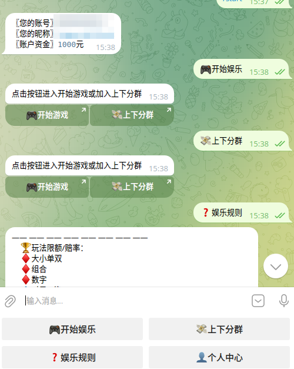
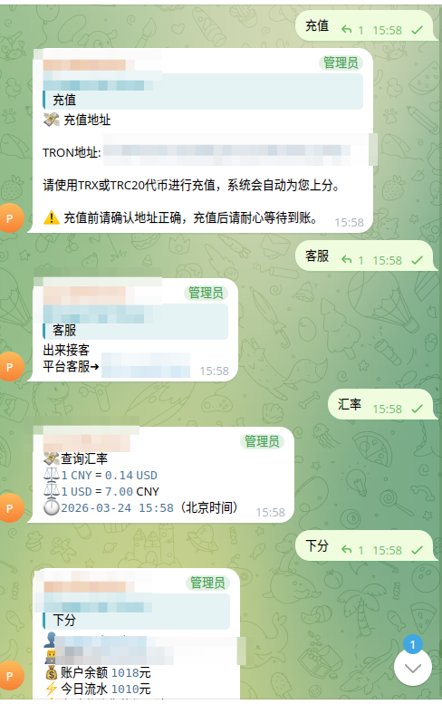
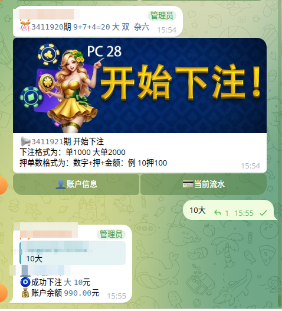
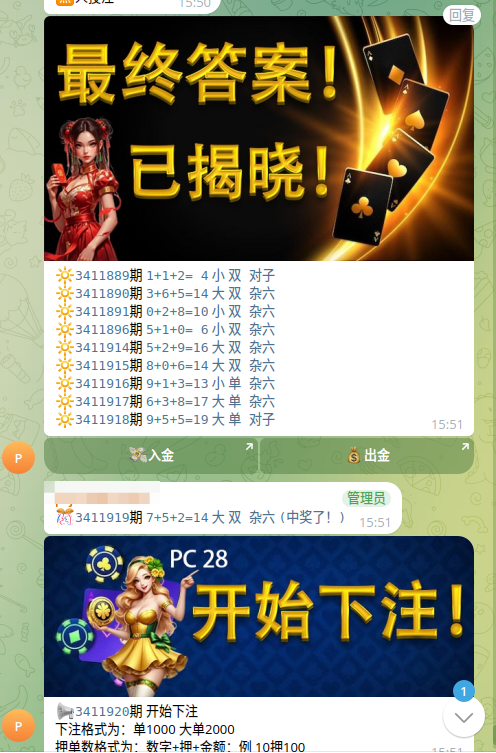
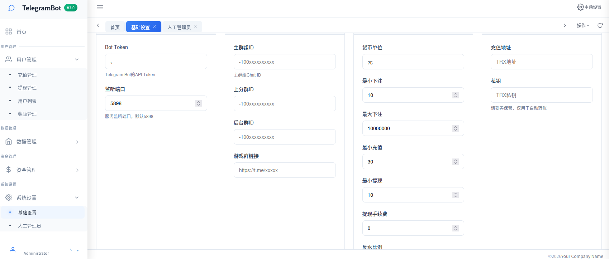

# 加拿大28 Telegram游戏系统

# Canada 28 Telegram Game System

## 项目更新说明

## Project Update Notice

此项目不断持续更新中，其中有不懂的问题可以联系我们，Telegram [@qazwsx3edc1](https://t.me/qazwsx3edc1)\
This project is continuously updated. If you have any questions, please contact us on Telegram: [@qazwsx3edc1](https://t.me/qazwsx3edc1)

## 项目简介

## Project Introduction

这是一个基于Node.js和Telegram Bot的加拿大28游戏系统，提供完整的在线投注、自动开奖、资金管理和后台管理功能。系统采用实时开奖数据，确保游戏的公平性和透明度。
This is a Canada 28 game system based on Node.js and Telegram Bot, providing complete online betting, automatic lottery drawing, fund management, and backend management functions. The system uses real-time lottery data to ensure game fairness and transparency.

## 技术栈

## Technology Stack

- **后端框架**: Node.js + Express
- **Backend Framework**: Node.js + Express
- **数据库**: MySQL
- **Database**: MySQL
- **Telegram API**: node-telegram-bot-api
- **Telegram API**: node-telegram-bot-api
- **前端**: HTML5 + CSS3 + JavaScript + Bootstrap + LayUI
- **Frontend**: HTML5 + CSS3 + JavaScript + Bootstrap + LayUI
- **区块链集成**: TRON (TRC20)
- **Blockchain Integration**: TRON (TRC20)

## 核心功能

## Core Features

### 1. Telegram机器人交互

### 1. Telegram Bot Interaction

- 自动处理用户投注指令（大小单双、豹子、顺子、对子等）
- Automatically process user betting commands (Big/Small, Odd/Even, Triple, Straight, Pair, etc.)
- 实时查询账户余额和流水
- Real-time account balance and transaction history queries
- 自动发送开奖结果和历史记录
- Automatically send lottery results and history records
- 支持私聊和群聊模式
- Support private chat and group chat modes

### 2. 游戏系统

### 2. Game System

- **玩法多样**: 支持大小单双、豹子、顺子、对子、点杀等多种玩法
- **Multiple Game Types**: Support Big/Small, Odd/Even, Triple, Straight, Pair, Point Kill, etc.
- **实时开奖**: 自动从官方数据源获取开奖结果
- **Real-time Lottery**: Automatically fetch lottery results from official data sources
- **赔率系统**: 可配置的赔率设置，支持不同玩法的差异化赔率
- **Odds System**: Configurable odds settings, supporting differentiated odds for different game types
- **投注限额**: 支持单注和总注限额设置
- **Bet Limits**: Support single bet and total bet limit settings

### 3. 资金管理

### 3. Fund Management

- **充值系统**: 支持TRON TRC20代币充值
- **Recharge System**: Support TRON TRC20 token deposits
- **提现管理**: 人工审核的提现流程
- **Withdrawal Management**: Manual review withdrawal process
- **返水系统**: 自动计算并发放返水奖励
- **Rebate System**: Automatic calculation and distribution of rebate rewards
- **邀请奖励**: 支持用户邀请返佣机制
- **Invitation Rewards**: Support user invitation commission mechanism

### 4. 后台管理系统

### 4. Backend Management System

- **用户管理**: 用户信息查看、余额调整
- **User Management**: User information viewing, balance adjustment
- **投注管理**: 查看所有投注记录和开奖结果
- **Bet Management**: View all betting records and lottery results
- **资金管理**: 充值提现申请处理
- **Fund Management**: Process deposit and withdrawal applications
- **数据统计**: 实时统计今日流水、盈利、注册用户等数据
- **Data Statistics**: Real-time statistics of daily turnover, profits, registered users, etc.

## 机器人测试截图

## Bot Test Screenshots






## 后台管理系统截图

## Backend Management System Screenshots



## 项目结构

## Project Structure

```
jnd28/
├── admin/             # 后台管理系统
├── admin/             # Backend Management System
│   ├── css/          # 样式文件
│   ├── css/          # CSS Files
│   ├── js/           # JavaScript文件
│   ├── js/           # JavaScript Files
│   └── *.html        # 管理页面
│   └── *.html        # Management Pages
├── api/              # API接口
├── api/              # API Interfaces
│   ├── login.js      # 登录接口
│   ├── login.js      # Login Interface
│   ├── result.js     # 开奖结果接口
│   ├── result.js     # Lottery Result Interface
│   ├── table.js      # 数据表格接口
│   ├── table.js      # Data Table Interface
│   └── chart.js      # 数据统计接口
│   └── chart.js      # Data Statistics Interface
├── config/           # 配置文件
├── config/           # Configuration Files
│   ├── conf.js       # 主要配置
│   ├── conf.js       # Main Configuration
│   └── common.js     # 通用函数
│   └── common.js     # Common Functions
├── app.js            # 主应用文件
├── app.js            # Main Application File
└── package.json      # 项目依赖
└── package.json      # Project Dependencies
```

## 关键特性

## Key Features

### 自动开奖系统

### Automatic Lottery System

- 定时器自动从官方数据源获取开奖结果
- Timer automatically fetches lottery results from official data sources
- 自动计算用户投注输赢
- Automatically calculate user bet wins/losses
- 自动更新用户余额
- Automatically update user balances
- 支持封盘提醒和开奖通知
- Support closing reminders and lottery notifications

### 安全机制

### Security Mechanisms

- 用户认证和授权系统
- User authentication and authorization system
- 投注限额防止大额投注
- Bet limits prevent large bets
- 防作弊机制（禁止编辑已下注消息）
- Anti-cheating mechanism (prevent editing of placed bet messages)

### 可扩展性

### Extensibility

- 模块化设计，易于添加新玩法
- Modular design, easy to add new game types
- 配置化的赔率和限额设置
- Configurable odds and limit settings
- 支持多语言和多币种
- Support multiple languages and currencies

## 安装部署

## Installation and Deployment

1. **安装依赖**
1. **Install Dependencies**
```bash
npm install
```
安装项目所需的所有依赖包。

1. **配置数据库**
2. **Configure Database**
   编辑 `config/conf.js` 文件，设置MySQL数据库连接信息
   Edit the `config/conf.js` file to set MySQL database connection information
3. **配置Telegram Bot**
4. **Configure Telegram Bot**
   在 `config/conf.js` 中设置Telegram Bot Token和群组ID
   Set Telegram Bot Token and group ID in `config/conf.js`
5. **配置后台管理系统**
6. **Configure Backend Management System**
   编辑 `admin/config.js` 文件，修改服务器IP地址：
   Edit the `admin/config.js` file to modify the server IP address:

```javascript
var url = "http://your-server-ip:5898" // 修改为实际服务器IP
var url = "http://your-server-ip:5898" // Change to actual server IP
```

1. **启动服务**
2. **Start Service**

```bash
node app.js
```

1. **访问后台**
2. **Access Backend**
   浏览器访问 `http://your-server:5898/admin`
   Access via browser: `http://your-server:5898/admin`

## 使用说明

## Usage Instructions

### 用户端

### User Side

1. 添加机器人为好友或加入游戏群组
2. Add the bot as a friend or join the game group
3. 使用 `/start` 命令开始游戏
4. Use the `/start` command to start the game
5. 发送投注指令（如："大100"、"豹子50"等）
6. Send betting commands (e.g., "Big 100", "Triple 50", etc.)
7. 查询余额、流水和开奖历史
8. Check balance, transaction history, and lottery history

### 管理端

### Management Side

1. 使用管理员账号登录后台
2. Log in to the backend with an administrator account
3. 查看用户信息和投注记录
4. View user information and betting records
5. 处理充值和提现申请
6. Process deposit and withdrawal applications
7. 监控系统数据和统计信息
8. Monitor system data and statistics

## 安全注意事项

## Security Notes

- 定期备份数据库
- Regularly back up the database
- 保护Bot Token和数据库密码
- Protect Bot Token and database passwords
- 限制管理员权限，防止滥用
- Limit administrator permissions to prevent abuse
- 监控异常投注行为
- Monitor abnormal betting behavior

## 许可证

## License

ISC License
ISC License

***

***

**注意**: 本项目仅用于学习和技术研究，请勿用于非法赌博活动。使用本项目时请遵守当地法律法规。
**Note**: This project is for learning and technical research only, please do not use it for illegal gambling activities. Please comply with local laws and regulations when using this project.
